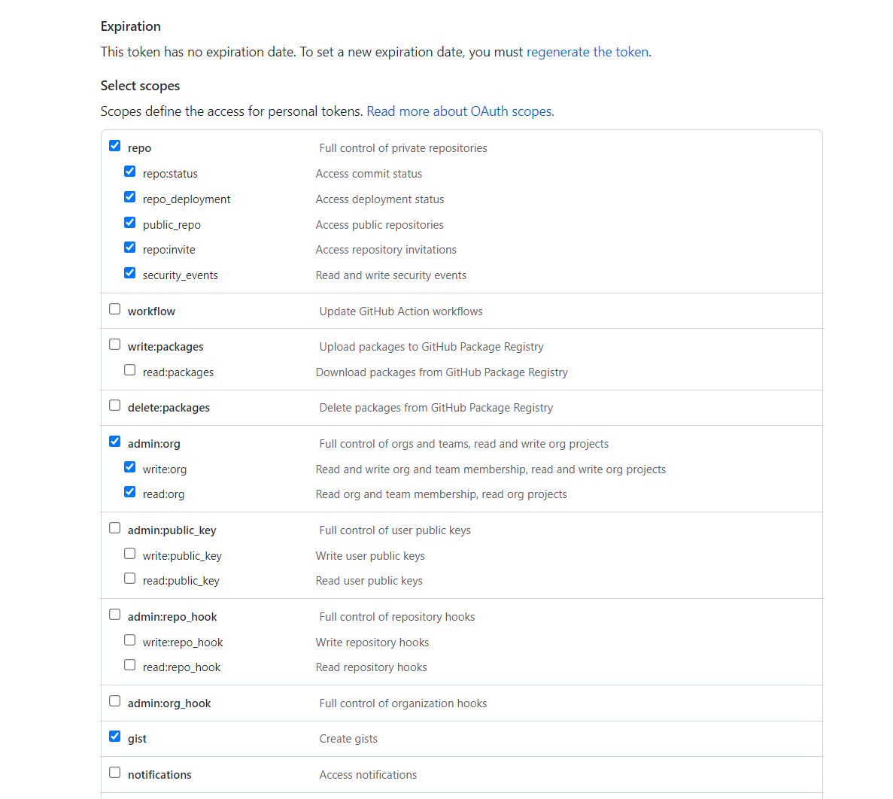

<p align="center">
    
    <a href='https://github.com/MShawon/github-clone-count-badge'></a>
</p>

# GitHub Clone Count Badge

This clone count badge shows **more than 14 days** of clone statistics of a GitHub repository.

## How it works
* Uses the following GitHub action to get repository clone count using `https://api.github.com/repos/{username}/{repo}/traffic/clones` this API. Then the **clone.json** file will be added to the user's https://gist.github.com/ account.
* This action will run every 24th hours to update clone.json with the latest data. Unfortunately, GitHub API allows users to show only the last 14 day's clone data. But this badge will show all the statistics from the day you implement this action.
* **clone.json** posted on https://gist.github.com/ will act as a database.
* Then shields.io dynamic badge will parse this **clone.json** file to show the clone count.
* Clone count badge is in **CLONE.md** file

## Setup (~5 minute setup)
1) [Create a new workflow](https://docs.github.com/en/actions/quickstart#creating-your-first-workflow) from the `Actions` tab of your repository. Name the file `clone.yml` and paste the following:
```yaml
name: GitHub Clone Count Update Everyday

on:
  schedule:
    - cron: "0 */24 * * *"
  workflow_dispatch:

jobs:
  build:
    runs-on: ubuntu-latest

    steps:
      - uses: actions/checkout@v2
      
      - name: gh login
        run: echo "${{ secrets.SECRET_TOKEN }}" | gh auth login --with-token

      - name: parse latest clone count
        run: |
          curl --user "${{ github.actor }}:${{ secrets.SECRET_TOKEN }}" \
            -H "Accept: application/vnd.github.v3+json" \
            https://api.github.com/repos/${{ github.repository }}/traffic/clones \
            > clone.json

      - name: create gist and download previous count
        id: set_id
        run: |
          if gh secret list | grep -q "GIST_ID"
          then
              echo "GIST_ID found"
              echo "GIST=${{ secrets.GIST_ID }}" >> $GITHUB_OUTPUT
              curl https://gist.githubusercontent.com/${{ github.actor }}/${{ secrets.GIST_ID }}/raw/clone.json > clone_before.json
              if cat clone_before.json | grep '404: Not Found'; then
                echo "GIST_ID not valid anymore. Creating another gist..."
                gist_id=$(gh gist create clone.json | awk -F / '{print $NF}')
                echo $gist_id | gh secret set GIST_ID
                echo "GIST=$gist_id" >> $GITHUB_OUTPUT
                cp clone.json clone_before.json
                git rm --ignore-unmatch  CLONE.md
              fi
          else
              echo "GIST_ID not found. Creating a gist..."
              gist_id=$(gh gist create clone.json | awk -F / '{print $NF}')
              echo $gist_id | gh secret set GIST_ID
              echo "GIST=$gist_id" >> $GITHUB_OUTPUT
              cp clone.json clone_before.json
          fi

      - name: update clone.json
        run: |
          curl https://raw.githubusercontent.com/MShawon/github-clone-count-badge/master/main.py > main.py
          python3 main.py

      - name: Update gist with latest count
        run: |
          content=$(sed -e 's/\\/\\\\/g' -e 's/\t/\\t/g' -e 's/\"/\\"/g' -e 's/\r//g' "clone.json" | sed -E ':a;N;$!ba;s/\r{0,1}\n/\\n/g')
          echo '{"description": "${{ github.repository }} clone statistics", "files": {"clone.json": {"content": "'"$content"'"}}}' > post_clone.json
          curl -s -X PATCH \
            --user "${{ github.actor }}:${{ secrets.SECRET_TOKEN }}" \
            -H "Content-Type: application/json" \
            -d @post_clone.json https://api.github.com/gists/${{ steps.set_id.outputs.GIST }} > /dev/null 2>&1

          if [ ! -f CLONE.md ]; then
            shields="https://img.shields.io/badge/dynamic/json?color=success&label=Clone&query=count&url="
            url="https://gist.githubusercontent.com/${{ github.actor }}/${{ steps.set_id.outputs.GIST }}/raw/clone.json"
            repo="https://github.com/MShawon/github-clone-count-badge"
            echo ''> CLONE.md
            echo '
            **Markdown**

            ```markdown' >> CLONE.md
            echo "[]($repo)" >> CLONE.md
            echo '
            ```

            **HTML**
            ```html' >> CLONE.md
            echo "<a href='$repo'></a>" >> CLONE.md
            echo '```' >> CLONE.md
            
            git add CLONE.md
            git config --global user.name "GitHub Action"
            git config --global user.email "action@github.com"
            git commit -m "create clone count badge"
          fi

      - name: Push
        uses: ad-m/github-push-action@master
        with:
          github_token: ${{ secrets.GITHUB_TOKEN }}

```
2) But to use this, you will need a personal access token. See [this docs](https://docs.github.com/en/authentication/keeping-your-account-and-data-secure/managing-your-personal-access-tokens#creating-a-personal-access-token-classic) to get one. And make sure to select the following scopes:

<p align='center'></p>

3) Next, add action secrets to this repository like [this docs](https://docs.github.com/en/actions/security-guides/using-secrets-in-github-actions?tool=webui#creating-secrets-for-a-repository). Remember `SECRET_TOKEN` must be the secret name. And the value will be the **personal access token** you just generated.  

<p align='center'></p>

4) Grant `Read and write permissions` to the workflow to add **CLONE.md** file to your repository. See [this docs](https://docs.github.com/en/repositories/managing-your-repositorys-settings-and-features/enabling-features-for-your-repository/managing-github-actions-settings-for-a-repository#configuring-the-default-github_token-permissions).

<p align='center'></p>

## Badge Usage

Once you set it up correctly and the action is run for the very first time, the action will automatically create a new gist named **clone.json** in your account.

But you don't know the gist link yet that the shields.io badge needs to parse.
So a **CLONE.md** file will be uploaded to your repository's default branch which will contain the code required to add to your README.

[action will create CLONE.md every time if not found]
